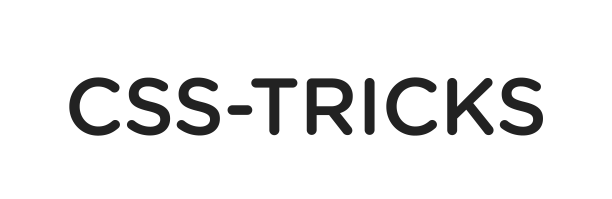

# iSpeechBoard - AAC Communication Board for Web Browsers

iSpeechBoard is an augmentative and alternative communication (AAC) web application, allowing users with speech and language impairments (autism, cerebral palsy) to communicate with symbols and text-to-speech.

The app uses the browser's Speech Synthesis API to generate speech when a symbol is clicked. There are thousands of symbols from the most popular AAC symbol libraries to choose from when creating a board.
iSpeechBoard is available in 40 languages (support varies by platform - Android, iOS, Windows).

The future scalling plans include : Mobile Apps, 50 Languages

**I am using Github, Jira and Discord to collaborate**

## How does it work?

## Translations

Currently the app supports 40 languages.
Languages were machine translated and require proofreading: if you want to help proofread
**You do not need to be a programmer!**

Translations play a major role in this project and they contribute a lot for the inclusion of children, specially in non developed countries. Please consider collaborating with us!

### Translations for developers

In order to pull the latest translations from CrowdIn into the codebase, you can run `yarn translations:pull`. This will update all language files such as `en.json` as well as the central `cboard.json` file. Please note that this requires the CrowdIn API key to be available in the `.private` config file. Refer to [Secrets Management](#secrets-management). After the script completes, changes to the translation files will need to be committed to the repo by the usual process.

## Getting Started iSpeechBoard

### `npm start` or `yarn start`

Runs the app in development mode. 
Open [http://localhost:3000](http://localhost:3000) to view it in the browser.

The page will reload if you make edits. 
You will see the build errors and lint warnings in the console.

### `npm test` or `yarn test`

Runs the test watcher in an interactive mode. 
By default, runs tests related to files changed since the last commit.

[Read more about testing.](https://github.com/facebookincubator/create-react-app/blob/master/packages/react-scripts/template/README.md#running-tests)

### `npm run build` or `yarn build`

Builds the app for production to the `build` folder. 
It correctly bundles React in production mode and optimizes the build for the best performance.

iSpeechBoard is ready to be deployed.

### `npm run build-cordova-debug`

Use this to produce non-minified build for use in debugging within Cordova. It uses `react-app-rewired` & `config-overrides.js` to customize webpack operation without ejecting react.

## Thanks

### Symbols sources

 [Mulberry](https://mulberrysymbols.org/)

 [ARASAAC](http://www.arasaac.org/)

 [Global Symbols](https://globalsymbols.com/)

### Translation

### Testing platform

[ Browserstack](https://www.browserstack.com/) - for providing the automation infrastructure for testing.

### Development

[ CSS Tricks](https://css-tricks.com) - for providing feedback and support from the early stage.

## :memo: Legal & licenses

This program is free software: you can redistribute it and/or modify it under the terms of the GNU General Public License version 3 as published by the Free Software Foundation.

- Code - [GPLv3](https://github.com/cboard-org/cboard/blob/master/LICENSE.txt](https://github.com/bwoinextdoor/iSpeechBoard)
- Mulberry Symbols - [CC BY-SA 4.0](https://creativecommons.org/licenses/by-sa/4.0/)
- ARASAAC Symbols - [CC BY-NC-SA 4.0](https://creativecommons.org/licenses/by-nc-sa/4.0/)
